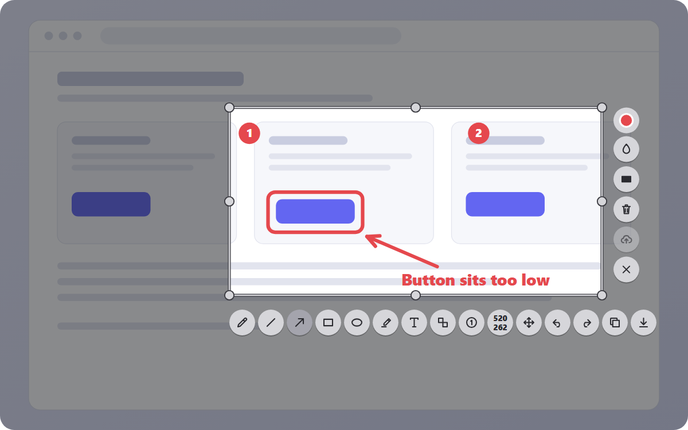

# QuickSnap: Screen Capture and Screenshot Annotation Tool for Windows, Mac and Linux

**QuickSnap** is a desktop **screenshot tool** that lets you capture any area of your screen, **annotate the screenshot** with arrows, boxes, text, numbered markers, blur and redaction, and then copy it to the clipboard or save it as PNG or JPEG. It runs quietly in the system tray and starts with one key press.

*Illustration of the QuickSnap capture screen (drawn from the real interface, not a photo of a live session).*

> **Preview build, v0.1.0.** These installers are early, **unsigned** and only lightly tested, so Windows and macOS will show a security warning. Screen **recording** and **share links** are **not available yet**. Current builds never upload your screenshots. Website: <https://quicksnaptool.com>

## Download QuickSnap

| Your system | Installer | Requirements | Status |
|---|---|---|---|
| **Windows** | [QuickSnap_0.1.0_x64-setup.exe](https://github.com/vikingcodes/quicksnap-releases/releases/download/v0.1.0-preview.4/QuickSnap_0.1.0_x64-setup.exe) | Windows 10 or 11, 64-bit | Preview. Installed and launched on Windows 10 before publishing |
| **Mac** | [QuickSnap_0.1.0_aarch64.dmg](https://github.com/vikingcodes/quicksnap-releases/releases/download/v0.1.0-preview.4/QuickSnap_0.1.0_aarch64.dmg) | Apple Silicon Macs only (no Intel build yet) | Built automatically, **not tested** |
| **Linux** | [QuickSnap_0.1.0_amd64.deb](https://github.com/vikingcodes/quicksnap-releases/releases/download/v0.1.0-preview.4/QuickSnap_0.1.0_amd64.deb) | 64-bit, built on Ubuntu 24.04 (use a similarly recent distribution) | Built automatically, **not tested** |

All files are on the [latest release page](https://github.com/vikingcodes/quicksnap-releases/releases/tag/v0.1.0-preview.4), together with `SHA256SUMS.txt` so you can [verify your download](#verify-your-download).

## What is QuickSnap?

QuickSnap is a **screen capture tool** for people who explain things on screen: developers writing bug reports, support teams guiding customers, designers giving feedback, teachers building step-by-step guides, and anyone who wants to mark up a screenshot quickly. Instead of capturing, opening a separate image editor, drawing, and saving, you do all of it in one place, right on top of your screen.

## How QuickSnap works

1. **Press the capture key.** Press **Print Screen** (you can change the key). QuickSnap takes a snapshot of the screen under your mouse pointer and shows it frozen and slightly dimmed. Because the picture is frozen, what you select is exactly what you get, even if something on screen changes.
2. **Select an area.** Drag a rectangle over the part you want. A badge shows its size in pixels. You can drag any of the eight round handles to resize it, or use the **Move** tool to reposition it.
3. **Annotate.** A row of round buttons appears under the selection, with a second column on its right. Pick a tool and draw inside the selection: arrow, rectangle, ellipse, line, pen, highlighter, text, numbered markers, blur, pixelate or solid redaction. Undo, redo and clear are always available.
4. **Copy or save.** Press **Enter** (or the copy button) to put the finished image on the clipboard, ready to paste into a chat, email or document. Press **Ctrl+S** (or the save button) to save it as a PNG or JPEG file where you choose. Press **Esc** at any time to cancel without keeping anything.

Want no editing at all? Press **Shift + Print Screen** to save the whole screen straight to `Pictures\QuickSnap` with no dialog. Existing files are never overwritten.

QuickSnap stays in the **system tray** while idle. Right-click the tray icon for **Capture**, **Preferences…** and **Quit**.

## Features

- **Screenshot capture:** select any area of the screen under your cursor, with a frozen preview for accurate selection.
- **Screenshot annotation tools:** pen, highlighter, line, arrow, rectangle, ellipse, text, numbered markers (1, 2, 3 …), blur, pixelate and solid redaction.
- **Hide sensitive information:** blur and pixelate are visual effects and may not fully hide small text, so use **solid redaction** to cover private details permanently. Check the result before you share it.
- **Copy to clipboard** or **save as PNG or JPEG** (with an adjustable JPEG quality).
- **Instant save** of the full screen with one shortcut.
- **Global shortcuts** you can change, with a clear message and fallback if another program (such as OneDrive or the Windows Snipping Tool) already uses Print Screen.
- **Native notifications** after copying or saving (can be turned off).
- **Options window:** keep the selection position, include a mouse cursor in the screenshot (drawn as a simplified arrow), choose the image format, and more.

## Keyboard shortcuts

| Action | Shortcut |
|---|---|
| Start a capture | **Print Screen** (fallback **Ctrl+Shift+S** if Print Screen is taken) |
| Save the full screen instantly | **Shift + Print Screen** |
| Copy the finished image | **Enter** or **Ctrl+C** |
| Save to a file | **Ctrl+S** |
| Undo / redo | **Ctrl+Z** / **Ctrl+Y** (or **Ctrl+Shift+Z**) |
| Cancel | **Esc** |
| Change line thickness | Mouse wheel |

**Tool keys** while annotating: **P** pen, **M** highlighter, **D** line, **A** arrow, **R** rectangle, **C** ellipse, **T** text, **N** numbered marker, **U** blur, **B** pixelate, **X** solid redaction, **V** move selection.

## Install guide

### Windows 10 and 11
1. Download `QuickSnap_0.1.0_x64-setup.exe` and run it.
2. If Windows shows **"Windows protected your PC"**, choose **More info → Run anyway**. This appears because the installer is not code-signed yet.
3. QuickSnap starts in the system tray (use the arrow by the clock if you do not see it). Press **Print Screen** to capture.
4. To remove it: **Settings → Apps → QuickSnap → Uninstall**.

If Print Screen does nothing, another program owns it. QuickSnap opens its options window and falls back to **Ctrl+Shift+S**. To use Print Screen, turn off *Settings → Accessibility → Keyboard → Use the Print screen button to open screen capture* and any screenshot option in OneDrive.

### Mac (Apple Silicon)
1. Download `QuickSnap_0.1.0_aarch64.dmg`, open it and drag QuickSnap to **Applications**.
2. The app is not notarized, so macOS may refuse to open it at first. Try right-click → **Open**, or use **System Settings → Privacy & Security → Open Anyway**.
3. Capturing the screen needs the **Screen Recording** permission (System Settings → Privacy & Security). This build has **not been tested on a Mac**, so please report what you see.

### Linux (Debian, Ubuntu)
1. Download `QuickSnap_0.1.0_amd64.deb` and install it: `sudo apt install ./QuickSnap_0.1.0_amd64.deb`
2. This build has **not been tested on Linux**. On **Wayland** desktops a global shortcut and area capture may be limited, and the tray icon needs desktop support for tray icons. Please report your distribution and desktop.

## Verify your download

Compare each file's SHA-256 checksum with `SHA256SUMS.txt` from the release:

| File | SHA-256 |
|---|---|
| `QuickSnap_0.1.0_x64-setup.exe` | `27f4eb58867e4a38a52effb9cd7231bd2d2df78c9f1548bc28bd41ca83b02eec` |
| `QuickSnap_0.1.0_aarch64.dmg` | `8dd25bcab71102f41f10d5e67cdaa0c470c23a68410938ba274758ebacecf748` |
| `QuickSnap_0.1.0_amd64.deb` | `9df7f6379f7d60a476cbfb89e6174655c72876523672391e5dadc0088abf38a6` |

- **Windows (PowerShell):** `Get-FileHash .\QuickSnap_0.1.0_x64-setup.exe -Algorithm SHA256`
- **Mac:** `shasum -a 256 QuickSnap_0.1.0_aarch64.dmg`
- **Linux:** `sha256sum QuickSnap_0.1.0_amd64.deb`

## Privacy

- Your screenshots stay on your computer. **These builds contain no upload code.**
- Nothing is sent automatically: no screenshots, annotation text or clipboard contents leave your machine, and the app contains no analytics. (The website, quicksnaptool.com, uses Google Analytics; you can turn it off with the link in the website footer.)
- Files are saved only where you choose, or to `Pictures\QuickSnap` when you use instant save.
- Settings (shortcuts, format, options) are stored in a small settings file on your computer.

## Known limitations

- **Screen recording is not available yet.** Neither is audio capture.
- **Share links and cloud upload are not available yet.** Some options (auto-copy link, instant upload hotkey, proxy) can be saved but have no effect until sharing exists.
- Capture covers **the monitor under your mouse pointer**, not a combined view of several monitors.
- Mac and Linux builds are untested; there is no Intel Mac, ARM Windows, `.rpm` or AppImage build.
- Installers are **unsigned**, so operating systems show warnings.
- Windows 10 on a 64-bit PC is the only combination that has been tried by hand so far.

## Roadmap (plans, not promises)

Screen recording, shareable links, signed installers, more platforms and a proper notarized Mac build are being considered. Nothing here has a date.

## Frequently asked questions

**What is QuickSnap?** A desktop screen capture and screenshot annotation tool for Windows, Mac and Linux (see the limitations above for what is tested).

**How do I take a screenshot of part of my screen?** Press Print Screen, drag over the area, then press Enter to copy it or Ctrl+S to save it.

**Can I annotate a screenshot with arrows and text?** Yes. Use the arrow (A), rectangle (R) and text (T) tools, among others.

**How do I blur or hide sensitive information in a screenshot?** Use blur, pixelate or, for guaranteed hiding, solid redaction (X). Blur and pixelate may not fully hide small text.

**Does QuickSnap upload my screenshots?** No. These builds have no upload feature.

**Does QuickSnap add a watermark?** No.

**Is it free?** Pricing has not been announced.

**Why does Windows or macOS warn me?** The installers are not code-signed yet. Verify the checksum above and only run files from this release page.

## Links

- Website: <https://quicksnaptool.com>
- [All releases](https://github.com/vikingcodes/quicksnap-releases/releases) and release notes
- This repository hosts the installers only. The source code is private.
